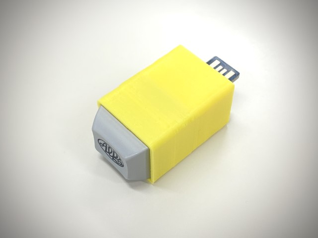

# UsbSleepJammer

自分で自分のPCの画面ロック時間を変更できない時に使う機器

## 機能

- PCに接続するUSBデバイスであり、スイッチを一つ備えている
- USBマウス及びキーボードデバイスとして動作する
  - USBマウスは一定の時間間隔で数ピクセルだけ左右に動かす
  - USBキーボードはスイッチを押された際に画面ロック（"Win + L" Windowsのみ）する
- 画面ロック中はインジケータが点灯し、マウスの機能は無効化される
  - もう一度押すと適当なキーコード（" " スペース）が送られ、マウスの機能が再度有効になる。

## 必要な部品

|部品|説明|購入先|
|:---|:---|:---|
|beetle USB 32u4|ATMega32u4が搭載されたArduino互換ボード|https://www.aliexpress.com/item/32845928676.html|
|キースイッチ|写真はAlpsクローン。Cherry MX系でも可|https://www.aliexpress.com/item/4000320410629.html|
|キーキャップ|1.25Uで適当に選ぶ。写真はAlpsの1.25U|https://pimpmykeyboard.com/ (現在は販売終了)|
|ケース|収まりの良いケース|3Dデータは以下|

その他にはスイッチとbeetle USB 32u4を結線するための配線材、はんだごてなどの工具が必要です

## 回路図

[schematics.pdf](schematics.pdf)

## ケースについて

3Dプリントできる収まりの良くないケースデータを公開します（予定）

 - ALPSスイッチ（1.25U向け）: [UsbSleepJammer_alps.stl](stl/UsbSleepJammer_alps.stl)
 - CherryMXスイッチ（1.25U向け）: [UsbSleepJammer_mx.stl](stl/UsbSleepJammer_mx.stl)
 
 FDM方式の3Dプリンタの場合スイッチがはまる方を下にして印刷すればサポート不要で印刷できると思います
 beetle USB 32u4は固定されないので適当にホットボンドか何かで固定してください
